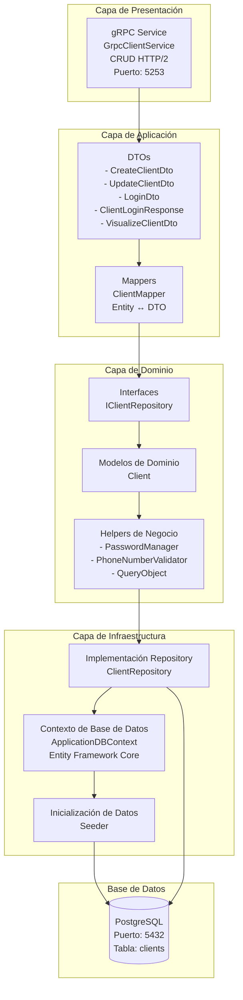

# censudex-clients-service

Servicio que permite la gestión de toda la información de los de los clientes de censudex

## Tecnologías utilizadas

- **Framework:** ASP.NET Core 9.0
- **Protocolo API:** gRPC (para comunicación con el API Gateway).
- **Base de Datos:** PostgreSQL
- **Control de Versiones:** Git con Conventional Commits

## Patrón Arquitectónico Principal

El Microservicio de Clientes está construido siguiendo un patrón de Arquitectura en Capas combinado con el Patrón Repository y principios de Clean Architecture. Este microservicio es responsable de gestionar la autenticación de clientes, registro y operaciones CRUD dentro del ecosistema censudex.



## Modelo de Datos

### Entidad User
```
Tabla: clients
├── Id (string, PK)
├── Role (string) - "Admin" | "User"
├── Name (string)
├── Surename (string)
├── Email (string, unique)
├── Username (string, unique)
├── Birthdate (DateOnly)
├── Address (string)
├── TelephoneNumber (string)
├── Password (string) - Hash BCrypt
├── RegistrationDate (DateOnly)
├── isActive (boolean)
└── DeactivationDates (List<DateOnly>)
```
Índices:

Clave Primaria: Id
Únicos: Email, Username
Recomendados: isActive, Role para optimización de consultas

### Estados de un Usuario:

- **Activo:** Usuario esta activo.
- **Inactivo:** Estación se encuentra inactiva.

### Endpoint Disponibles

| Método | Request | Response |Descripción |
|--------|---------|----------|-------------|
| `GetAllClients` | `google.protobuf.Empty` | `GetAllClientsResponse` | Obtiene la lista completa de todos los clientes registrados. Requiere rol Admin. |
| `GetClient` | `GetClientRequest` | `GetClientResponse` | Busca y retorna un cliente específico por su ID único.  | 
| `GetClientsFiltered` | `GetClientsFilteredRequest` | `GetClientsFilteredResponse` | Filtra clientes según múltiples criterios de búsqueda. Requiere rol Admin. | 
| `EnableDisableClient` | `EnableDisableClientRequest` | `EnableDisableClientResponse` | Alterna el estado activo/inactivo de un cliente. Requiere rol Admin. |
| `UpdateClient` | `UpdateClientRequest` | `UpdateClientResponse` | Actualiza la información de un cliente. Requiere autenticación JWT. El cliente solo puede actualizar su propio perfil. | 
| `RegisterClient` | `RegisterClientRequest` | `RegisterClientResponse` | Registra un nuevo cliente en el sistema. Endpoint público. | 


## Instalación y Configuración para entorno local

### Prerrequisitos

- **.NET 9 SDK:** [Download](https://dotnet.microsoft.com/download/dotnet/9.0)
- **Visual Studio Code o Visual Studio 2022:** [Download](https://code.visualstudio.com/)
- **Docker desktop** [Download for windows](https://docs.docker.com/desktop/setup/install/windows-install/)

### Pasos de Configuración
1.  **Clonar el Repositorio**:
    ```bash
    git clone https://github.com/Proyecto-Censudex-2025/censudex-clients-service.git
    cd censudex-clients-service
    cd ClientsService
    ```
2.  **Configurar la Base de Datos**:
    Para la creacion local de base de datos se debe de tener abierta la aplicación Docker desktop, una vez abierta se debe correr el comando:
    ```bash
    docker-compose up -d
    ```
    las credenciales se encuetran en el archivo appsettings.json en el apartado siguiente como base y ejemplo:
    
    ```
    "ConnectionStrings": {
    "Postgres": "Host=localhost;Port=5432;Database=db;Username=user;Password=password"
    }
    ```
    También se pueden configurar dentro de las variables de entorno (.env) siguiendo este formato:
    ```
    POSTGRES_CONNECTION=Host=hostname;Database=db;Username=user;Password=password
    ```
    si se tienen las dos, las credenciales de la variable de entorno toman prioridad.

3. **Instalar Dependencias**
    ```bash
    dotnet restore
    ```

4. **Ejecutar el Proyecto**
    ```bash
    dotnet run
    ```

Cuando quieras apagar definitivamente la aplicación recuerda utilizar el comando 
    ```
    docker-compose down
    ```
Para asegurarte de que la base de datos también se detenga    


## Notas
La mayoría de los endpoints necesitan de autorización para ser ejecutados, por lo que se recomienda hacer pruebas desde la ApiGateway.
